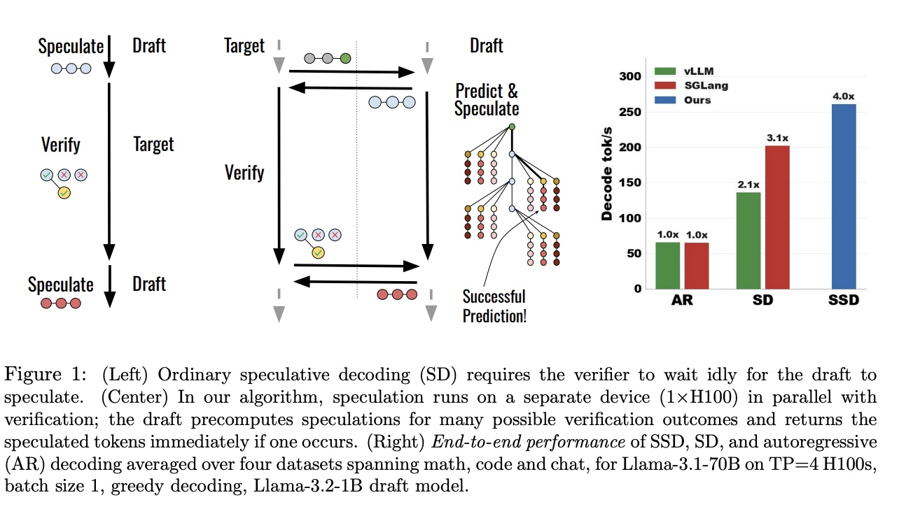
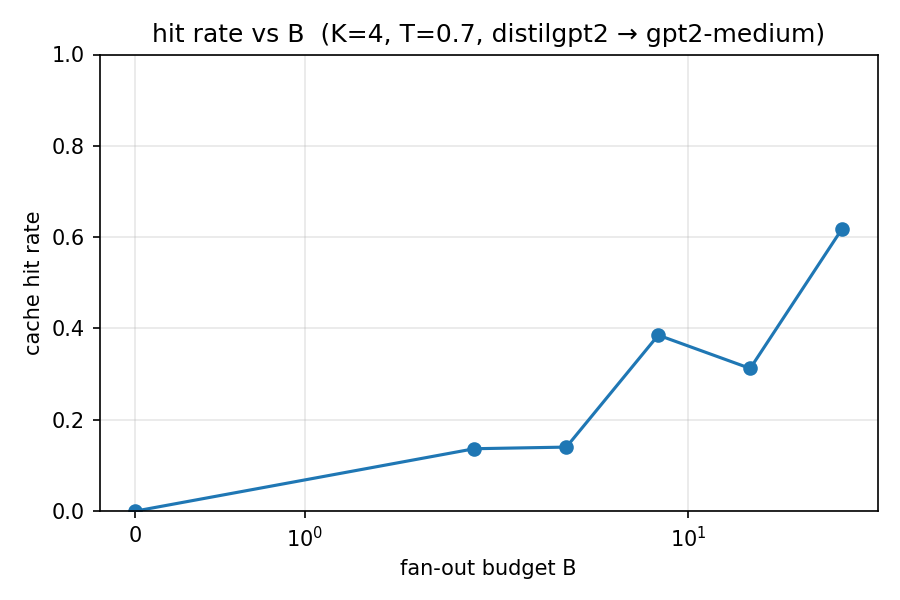
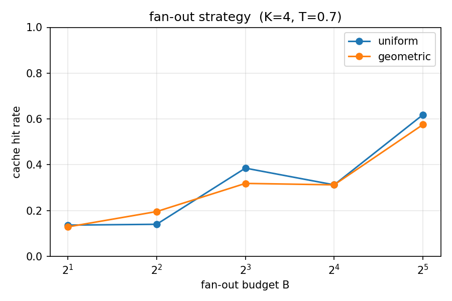
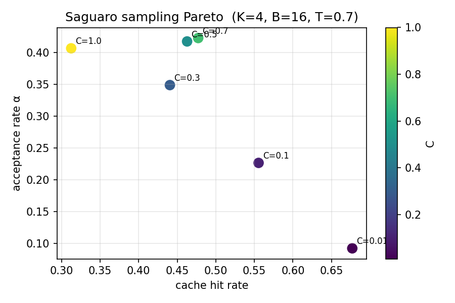

<div align="center">

# Speculative Speculative Decoding

**Implementation study of [*Speculative Speculative Decoding*](https://arxiv.org/abs/2603.03251) (Kumar, Dao & May, 2026), built on top of my from-scratch SD baseline.**

[Original SD repo](https://github.com/berezucc/speculative-decoding) · [Paper](https://arxiv.org/abs/2603.03251) · [Y Combinator interview](https://www.youtube.com/watch?v=wE1ZgJdt4uM&t=2382s)

</div>

---

## Background

A few weeks ago I built [`speculative-decoding`](https://github.com/berezucc/speculative-decoding), a from-scratch PyTorch implementation of [Leviathan et al. 2023](https://arxiv.org/abs/2211.17192), and benchmarked it on Apple Silicon to see where the wins actually come from.

Then I came across [this Y Combinator interview](https://www.youtube.com/watch?v=wE1ZgJdt4uM&t=2382s) on inference acceleration, which surfaced a brand-new paper: [*Speculative Speculative Decoding*](https://arxiv.org/abs/2603.03251) by Kumar, Dao & May (2026). It proposes a clever next step: parallelize the draft and verify phases across two devices so the drafter never sits idle. This repo is my implementation of that paper, layered on top of the SD baseline.

---

## Scope

SSD's headline numbers (30% over the best SD baselines, up to 5x over autoregressive) come from a 4xH100 verifier paired with a 1xH100 drafter. This repo runs on a single M2 Max, so it can't reproduce those wall-clock speedups; there's only one GPU to share.

What it *can* study, and what the benchmarks here measure:

- Cache hit rate as a function of the fan-out budget B
- Geometric (Theorem 12) vs uniform fan-out allocation
- The acceptance / hit-rate Pareto under Saguaro sampling

Output is **bit-identical to verifier-only greedy** at temperature 0, verified by 26 tests across every fan-out strategy and Saguaro `C` value.

---

## How SSD differs from SD

Ordinary SD alternates draft and verify; the drafter idles during verification and vice versa. SSD runs them in parallel on separate devices, with the drafter pre-speculating for several likely verification outcomes before knowing which one will occur.

<p align="center">
  
</p>

Three pieces are new:

1. **Speculation cache** (`src/cache.py`): `{(k_accepted, bonus_token) → K pre-speculated tokens}`. Cache hits skip the draft phase entirely.
2. **Outcome prediction** (`src/outcomes.py`): under a budget B, pick which `(k, bonus)` outcomes to cache. The geometric fan-out (Theorem 12) gives fewer guesses to deeper positions since they're exponentially less likely to be reached.
3. **Saguaro sampling** (`src/sampling.py`): downweight the top-F draft tokens during sampling so the residual `max(p_target - p_draft, 0)` lands on cached candidates more often. Trades acceptance rate for cache hit rate.

---

## Quick start

```bash
pip install -r requirements.txt
make test          # 26 tests, ~30 s on M2 Max
make bench         # all three benchmarks; ~25 min total
```

Custom run:

```bash
python benchmarks/cache_hit_rate.py --draft distilgpt2 --verifier gpt2-medium \
    --budgets 0 4 16 64 --k 4 --temperature 0.7 --n_tokens 30
```

Defaults: draft `distilgpt2` (82M), verifier `gpt2-medium` (355M). A shared tokenizer is required.

---

## Findings

*M2 Max, distilgpt2 → gpt2-medium, K=4, temperature 0.7, 4 prompts averaged. Small samples, so trends are what matter, not absolute numbers.*

### 1. Cache hit rate scales monotonically with B

<p align="center">
  
</p>

| B | 0 | 2 | 4 | 8 | 16 | 32 |
|---|---|---|---|---|---|---|
| hit rate | 0% | 14% | 14% | 39% | 31% | 62% |
| acceptance α | 34% | 40% | 33% | 28% | 41% | 39% |

Hit rate at B=0 is 0% (no cache, equivalent to ordinary SD with bookkeeping). By B=32 the cache lands 62% of verification outcomes. Bumps at B=4→8 and B=8→16 are sample-size noise; only ~20 verification rounds per config. Consistent with the power-law decay in rejection rate from Figure 3 of the paper.

### 2. Geometric fan-out ≈ uniform at this scale

<p align="center">
  
</p>

| B | uniform | geometric |
|---|---|---|
| 2 | 14% | 13% |
| 4 | 14% | 20% |
| 8 | 39% | 32% |
| 16 | 31% | 31% |
| 32 | 62% | 58% |

Geometric (Theorem 12) needs an estimate of the draft acceptance rate `a_p`. I passed 0.7, but actual α is ~35%; with this mismatch the formula isn't better than uniform. The paper's advantage shows up most clearly at higher temperatures where the gap widens. **Takeaway**: geometric isn't free here, it needs an accurate `a_p` to pay off. Uniform is a safe default.

### 3. Saguaro sampling: clean acceptance / hit-rate tradeoff

<p align="center">
  
</p>

| C | hit rate | acceptance α |
|---|---|---|
| 1.0 (vanilla) | 31% | 41% |
| 0.7 | **48%** | **42%** |
| 0.5 | 46% | 42% |
| 0.3 | 44% | 35% |
| 0.1 | 56% | 23% |
| 0.01 | 68% | 9% |

The cleanest result of the three. Aggressive biasing (C=0.01) almost doubles cache hits but collapses acceptance to 9%. Mild biasing (C≈0.7) appears to improve both metrics on this small sample, matching the paper's claim that Saguaro has a sweet spot in C. With more prompts the C=0.7 "free lunch" would likely settle into a clearer monotonic trade.

---

## Attribution

```bibtex
@article{kumar2026ssd,
  title   = {Speculative Speculative Decoding},
  author  = {Kumar, Tanishq and Dao, Tri and May, Avner},
  journal = {arXiv preprint arXiv:2603.03251},
  year    = {2026},
  url     = {https://arxiv.org/abs/2603.03251}
}

@inproceedings{leviathan2023fast,
  title     = {Fast Inference from Transformers via Speculative Decoding},
  author    = {Leviathan, Yaniv and Kalman, Matan and Matias, Yossi},
  booktitle = {ICML},
  year      = {2023},
  url       = {https://arxiv.org/abs/2211.17192}
}
```

[MIT License](LICENSE)
